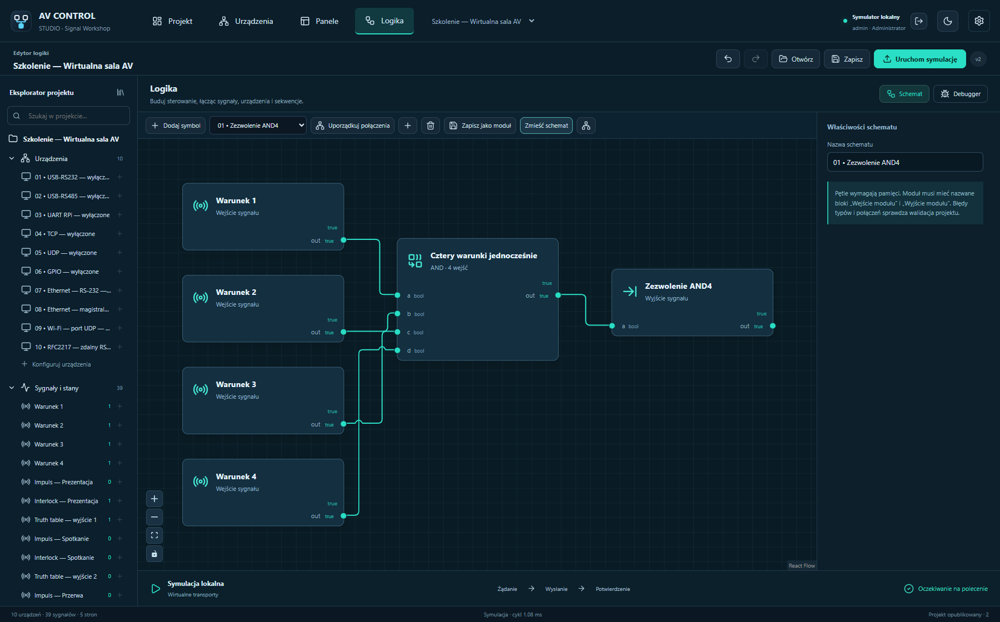
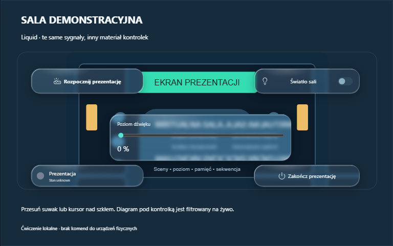
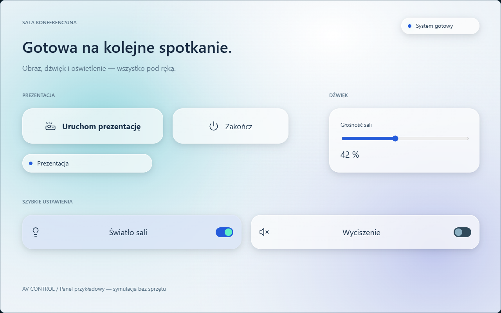
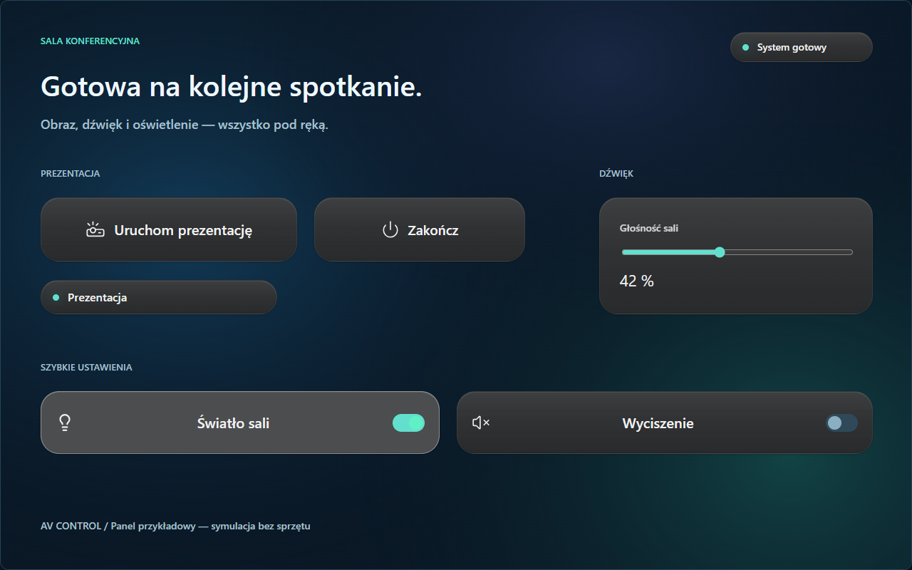
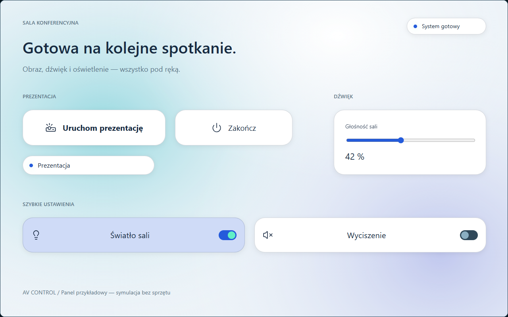

<picture>
  <source media="(prefers-color-scheme: dark)" srcset="media/logo-light.svg" />
  
</picture>

# One installation. Your devices. Your logic.

Build operator panels, connect equipment and program your installation locally.

**[Polski](README.pl.md) · English**

[**Download 1.6.1 — Signal Workshop**](https://github.com/Gartom91/av-control-studio/releases/tag/v1.6.1) · [Release history](CHANGELOG.md) · [Training course](https://github.com/Gartom91/av-control-studio/releases/download/v1.6.1/AV-Control-Szkolenie-1.6.1.zip)

**Windows · Raspberry Pi 3B / 4B / 5 · Linux Player · Browser panels**

---

AV Control is a configurable platform for AV rooms, exhibitions and equipment installations. Define your devices, protocols, panels and logic; the Raspberry Pi runs the project independently after Studio closes. Daily control works locally without cloud services or an internet connection.

This is the **official distribution repository** for installers, controller images, updates, manuals and verification reports. Product sources and development history are maintained in a separate private repository. GitHub's automatic “Source code” downloads contain this repository's distribution documentation.

<picture>
  <source media="(prefers-color-scheme: light)" srcset="media/studio-light.png" />
  
</picture>

*Real application screenshots. The examples use virtual transports and disabled hardware connections.*

## Choose your application

| Application | Purpose | Download 1.6.1 |
| --- | --- | --- |
| **Studio** | Design devices, protocols, panels and logic; simulate, debug and publish. | [Windows x64](https://github.com/Gartom91/av-control-studio/releases/download/v1.6.1/AV-Control-Studio-1.6.1-Windows-x64.exe) |
| **Player** | Operate published panels on a separate computer, including full screen. | [Windows x64](https://github.com/Gartom91/av-control-studio/releases/download/v1.6.1/AV-Control-Player-1.6.1-Windows-x64.exe) · [Linux .deb](https://github.com/Gartom91/av-control-studio/releases/download/v1.6.1/AV-Control-Player-1.6.1-Linux-all.deb) · [Linux archive](https://github.com/Gartom91/av-control-studio/releases/download/v1.6.1/AV-Control-Player-1.6.1-Linux.tar.gz) |
| **Imager** | Select the Pi model, configure initial accounts/network, write and verify an SD card. Includes the image. | [Windows x64](https://github.com/Gartom91/av-control-studio/releases/download/v1.6.1/AV-Control-Imager-1.6.1-Windows-x64.exe) |
| **RPi Controller** | Execute logic and communicate with devices autonomously. | [SD image, ARM64](https://github.com/Gartom91/av-control-studio/releases/download/v1.6.1/AV-Control-RPi-1.6.1-arm64.img.xz) · [Runtime update](https://github.com/Gartom91/av-control-studio/releases/download/v1.6.1/AV-Control-Runtime-1.6.1-arm64.zip) |
| **Web panel** | Operate the same panels on a computer, tablet or phone. | Open the controller's HTTPS address. |

Windows: Windows 10 22H2 / Windows 11, x64; .NET and an offline WebView2 installer are included. Public Linux Player: Debian 13 / CPython 3.13 with GTK and WebKit. Pi image: Raspberry Pi OS Lite 64-bit. A Runtime update is for an existing AV Control controller, rather than an SD card.

## Signal Workshop

- **Live draft logic:** recalculation after edits and about every 200 ms without publishing; independent preview memory and reset.
- **Communication status:** UDP socket or serial port readiness is separate from a fresh device reply; TCP uses operating-system keepalive.
- **Welcome and project records:** separate start page, installation/client/team/service metadata, handover checklist and history.
- **Autonomous diagnostics:** controller health, communication faults, stale replies and incidents; optional scoped reports and login alerts in TECHNIKAV, with a four-step Proton Mail notification wizard, encrypted SMTP token and configurable recipients.
- **Text input:** onscreen keyboard hidden by default on PC/web and enabled by default on native HDMI. Enable it locally in Settings, My account or sign-in input settings.
- **Panel backgrounds:** upload from the inspector, gradients, crop/scale/position/tiling and nine-slice corners, shared by editor and operator.
- **Local HDMI panel:** automatic Raspberry Pi operator kiosk, USB mouse/touchpad/touchscreen input, initial-page selection and tty2 login console. [Guide](docs/HDMI-PANEL-EN.md).
- **One logic workspace:** devices, signals, protocol definitions, commands, sequences and Python share an explorer and contextual settings. Device names and icons describe the actual equipment.
- **Clear diagrams:** ports align with labels; routing avoids symbols, separates paths and shows crossings. Variable-input gates, Truth table, pulse Interlock with SET ALL/CLEAR, timers, counters, memories, latches and flip-flops are available.
- **Full Python:** a code editor, typed ports, state, parameters, helper modules and pinned dependencies. Import NumPy or other libraries, install from PyPI or compatible offline wheels, and test inside Studio. Administrator approval follows the exact code, helpers and requirements; changing them invalidates approval. Full CPython runs trusted code and is not a security sandbox.
- **Project selector:** themed menu with search, complete names and a current-project check mark; arrows, Enter and Escape. Account, appearance and settings stay at the right edge.
- **Debugger:** watch signal values and quality, memory, timers, sequences and device TX/RX; inspect traces and blocking reasons. Simulation supports forced inputs and pause/step for logic scans. Pause does not freeze transport I/O, running sequences or Python processes. Resizable splits in four positions, a full workspace and an independent window preserve the live session.
- **Everyday editing:** right click and shortcuts for cut/copy/paste, duplicate, delete, rename, alignment, groups, layers, style copying, position locking and jumping to connection endpoints.
- **Your appearance:** light, dark and system application themes, matching scrollbars and eight panel presets, with independently adjustable controls.

*One sample panel, one layout and the same bindings. Liquid filters the real background beneath its controls. This screenshot comes from the working renderer, with virtual signals and no hardware commands.*

Compare Frost, Soft Dark and Paper

**Frost** — light, diffuse surfaces over a quiet background.

**Soft Dark** — gently raised buttons and dark gradients.

**Paper** — a restrained light appearance and clear typography.

[Download the editable demonstration project](media/Sala-konferencyjna.avctrl) — four pages sharing the same layout; open in Studio 1.6.0 or newer and start simulation. It contains only virtual signals, without devices, actions or startup commands. [Rendering report](media/panel-showcase-verification.json).

[Illustrated project-picker guide](docs/PROJECT-PICKER-EN.md)

## Connect and automate

| Area | Capabilities |
| --- | --- |
| **Serial and GPIO** | USB–RS232/RS485, Pi UART and digital GPIO; stable USB identifiers, detected lines, conflict checks, serial format, flow control and RS485 direction. UART is enabled in the clean image without a serial console. |
| **Network expansion** | TCP client/listener, UDP, additional USB–Ethernet adapters on Pi and Ethernet/Wi-Fi serial gateways with per-channel settings, TCP/UDP and standard RFC2217 where supported. Presets explain Unitek Y-105, USR-W610 and CH343P TTL. |
| **Your protocols** | ASCII/UTF-8/HEX, parameters, frame endings/lengths, byte order, SUM/XOR/CRC, response fields, state mapping, spontaneous replies and polling. Reusable profiles keep installation addresses separate. |
| **WYSIWYG panels** | Pages, buttons, switches, faders, sliders, knobs, readouts, indicators, text and disk images; optional labels, frames, corners, CSS and PC/tablet/phone layouts. Editor and operator use the same renderer. |
| **Reliable actions** | Sequences, waits, timeouts and cancellation; permissions and mutual exclusion checked by the engine across API clients and multiple panels. Signal quality separates good, stale, unknown and error values. |
| **Deployment and operation** | Project validation, staged activation, history/restore, administrator/operator roles, HTTPS and certificate pinning. Browser-based Pi settings include network confirmation/rollback. GitHub updates cover all Windows apps and Pi Runtime with SHA256 checks and Pi startup rollback. |

There is no fixed device, page or block limit. Practical capacity depends on the controller and workload. One controller runs one active project; Studio stores multiple projects and controller connections.

## Start without hardware

1. Install **Studio** and sign in to its local simulator: `admin` / `simulation`.
2. Select **Otwórz projekt szkoleniowy** (open training project) and **Podręcznik szkoleniowy** (training manual).
3. Explore the examples and select **Uruchom symulację**. Define your own equipment commands before enabling physical transports.
4. Use **Imager** to prepare a Pi SD card; confirm the selected target before erasing it.
5. Publish the project and use **Player** or the controller's web panel for daily operation.

## Raspberry Pi first run

After preparing a card with **AV Control Imager** and completing its first boot, the default URL is **https://av-control.local:8443/**. A custom name such as `room-a` gives **https://room-a.local:8443/**. DHCP assigns the IP; the image does not use a fixed `192.168.1.23` address.

Sign in to the web interface as **`admin`** with the password you chose in Imager. **`avoperator`** is the separate Linux/SSH account. Read `AV-Control-parowanie.txt` and `AV-Control-CA.crt` from the boot partition after provisioning: Studio/Player use the URL and fingerprint; browsers require the correct CA trust and a covered certificate name. Then deploy a project; a new card waits for its first panel.

[**Complete first-run procedure**](docs/FIRST-RUN-EN.md) — Imager, DHCP/network discovery, certificates, accounts, deployment, login and HDMI/USB, updates, optional TECHNIKAV enrollment and troubleshooting.

## Learn and verify

- [Offline training course](https://github.com/Gartom91/av-control-studio/releases/download/v1.6.1/AV-Control-Szkolenie-1.6.1.zip) — **52 chapters, four appendices, 75 illustrations** and neutral example projects.
- [195-page PDF](https://github.com/Gartom91/av-control-studio/releases/download/v1.6.1/AV-Control-Studio-Tutorial-PL-Signal-Workshop.pdf) · [Training programme](https://github.com/Gartom91/av-control-studio/releases/download/v1.6.1/PROGRAM-SZKOLENIA-PL.md) — **10 sessions / 22 hours**.
- [Complete documentation](https://github.com/Gartom91/av-control-studio/releases/download/v1.6.1/AV-Control-Studio-1.6.1-Dokumentacja.zip) · [Python manual](https://github.com/Gartom91/av-control-studio/releases/download/v1.6.1/SYMBOLE-PYTHON-PL.md) · [USB, RS485 and UART](https://github.com/Gartom91/av-control-studio/releases/download/v1.6.1/USB-RS485-UART-PL.md) · [Network gateways](https://github.com/Gartom91/av-control-studio/releases/download/v1.6.1/EKSPANDERY-SIECIOWE-PL.md).
- [Verification report](https://github.com/Gartom91/av-control-studio/releases/download/v1.6.1/WERYFIKACJA-1.6.1.md) · [Build/test manifest](https://github.com/Gartom91/av-control-studio/releases/download/v1.6.1/RELEASE-MANIFEST.json) · [SHA256 sums](https://github.com/Gartom91/av-control-studio/releases/download/v1.6.1/SHA256SUMS.txt).

The detailed course and UI are currently in Polish. README and release descriptions are available in Polish and English; use the language links above.

[A physical Pi 4B passed the GitHub 1.5.3 → 1.5.5 update](docs/WERYFIKACJA-RPI-1.5.5-PO-PUBLIKACJI.md), preserving the project, settings, users, session and certificate with agreement across five panels. Computer tests and ARM64 emulation are reported separately. Physical 3B/5, clean SD boots, electrical UART/RS232/RS485/GPIO, purchased adapters and physical mobile devices require separate hardware trials. AV Control's installers currently have no publisher Authenticode signature; vendor installers are verified separately.

## Distribution and licensing

Use the release's **Assets** section. The manifest links verified packages to the tested product and exact successful CI commit. Version 1.5 distributes compiled applications and documentation with no product source archive. Bytecode and browser bundles are not encryption or a guarantee against reverse engineering. [Packaging details](https://github.com/Gartom91/av-control-studio/releases/download/v1.6.1/PAKOWANIE-BINARNE-1.5-PL.md).

Installed applications continue to use this repository for updates. The repository split does not require an SD rewrite or project replacement. Online update checks and PyPI installations require internet; local operation remains independent of them.

Earlier MIT releases and code derived from them keep their [original MIT terms](LICENSE-MIT-1.4.1.txt). MIT is not a blanket license for all new additions after 1.4.1; see the [license scope](LICENSE). Third-party components retain their licenses.

The [future EULA draft](EULA-PL-PROJEKT.md) uses an individual licensor with identity/address/contact placeholders. It explains possible future fees; it does not activate payments or new binding conditions. Licensing through TECHNIKAV remains a planned optional service.

[Report a bug or suggest a feature](https://github.com/Gartom91/av-control-studio/issues) · [Bilingual release standard](RELEASING.md) · [Polski](README.pl.md)

- [Accounts and sliding keyboard](docs/ACCOUNTS-AND-LOGIN-EN.md): panel sign-in, password changes, account administration and training.
