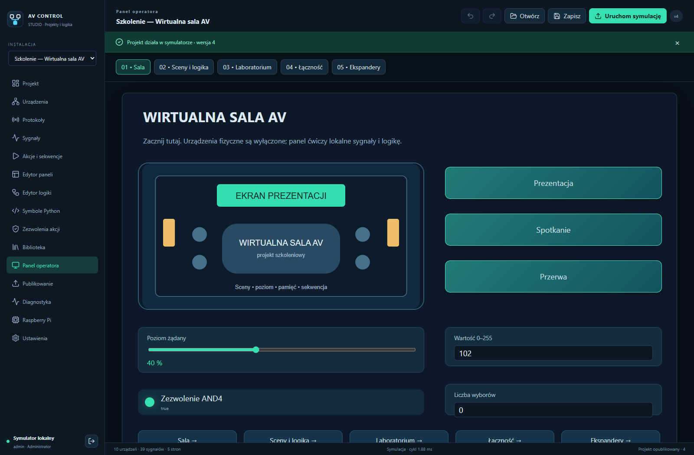

<picture>
  <source media="(prefers-color-scheme: dark)" srcset="media/logo-light.svg" />
  
</picture>

# One installation. Your devices. Your logic.

Design control panels, connect equipment and run your installation locally.

**[Polski](README.pl.md) · English**

[**Download the latest release**](https://github.com/Gartom91/av-control-studio/releases/latest) · [Release history](CHANGELOG.md) · [Training course](https://github.com/Gartom91/av-control-studio/releases/download/v1.4.1/AV-Control-Szkolenie-1.4.0.zip)

**Windows · Raspberry Pi 3B / 4B / 5 · Browser panels**

---

AV Control is a configurable platform for AV rooms, exhibitions and other equipment installations. You define the devices, protocols, operator panels and control logic. Projects run on a Raspberry Pi independently of the design computer. Routine control works without cloud services or an internet connection.

This is the **official distribution repository** for installers, controller images, updates, manuals and verification reports. Product development and source history are maintained in a separate private repository. GitHub's automatic “Source code” downloads contain this repository's distribution documentation.

> **Current stable release: 1.4.1.** The new Signal Workshop interface, debugger and expanded Python environment are in development. The features below describe the released version.

## Choose your application

| Application | Purpose | Download for 1.4.1 |
| --- | --- | --- |
| **Studio** | Configure devices, design panels and logic, simulate and publish projects. | [Windows x64 installer](https://github.com/Gartom91/av-control-studio/releases/download/v1.4.1/AV-Control-Studio-1.4.1-Windows-x64.exe) |
| **Player** | Run published operator panels on a separate computer, including full screen operation. | [Windows x64](https://github.com/Gartom91/av-control-studio/releases/download/v1.4.1/AV-Control-Player-1.4.1-Windows-x64.exe) · [Linux .deb](https://github.com/Gartom91/av-control-studio/releases/download/v1.4.1/AV-Control-Player-1.4.1-Linux-all.deb) · [Linux archive](https://github.com/Gartom91/av-control-studio/releases/download/v1.4.1/AV-Control-Player-1.4.1-Linux.tar.gz) |
| **Imager** | Write and verify an SD card; select the Pi model and configure the initial account and network. Includes the controller image. | [Windows x64 installer](https://github.com/Gartom91/av-control-studio/releases/download/v1.4.1/AV-Control-Imager-1.4.1-Windows-x64.exe) |
| **RPi Controller** | Execute logic and communicate with devices after Studio closes. | [SD image, ARM64](https://github.com/Gartom91/av-control-studio/releases/download/v1.4.1/AV-Control-RPi-1.4.1-arm64.img.xz) · [Runtime update](https://github.com/Gartom91/av-control-studio/releases/download/v1.4.1/AV-Control-Runtime-1.4.1-arm64.zip) |
| **Web panel** | Operate the same published panels from a computer, tablet or phone. | Open the controller's HTTPS address; no separate installer. |

Windows applications support Windows 10 22H2 and Windows 11, x64. Installers provide .NET and the offline WebView2 installer. The Pi image uses Raspberry Pi OS Lite 64-bit. A Runtime update is for an existing AV Control controller; it is not an SD image.

## Main capabilities

| Area | Capabilities |
| --- | --- |
| **Connections** | USB–RS232/RS485, Pi UART, TCP clients/listeners, UDP and digital GPIO. Stable USB selection through `by-id` or `by-path`, port conflict detection and diagnostics. |
| **Network expansion** | Additional USB–Ethernet adapters on the Pi; Ethernet/Wi-Fi serial gateways with per-channel addresses, TCP/UDP and standard RFC2217 where supported. |
| **Your protocols** | ASCII/UTF-8/HEX frames, parameters, framing, byte order, SUM/XOR/CRC, response parsing, spontaneous replies and polling. Reusable profiles with installation-specific addresses and ports. |
| **WYSIWYG panels** | Pages, buttons, switches, faders, sliders, knobs, values, indicators, text and images. Drag, resize, align, layers, groups, undo/redo and computer/tablet/phone layouts. Image import, optional labels, borders, rounded corners and custom CSS. |
| **Visual logic** | Variable-input gates, arithmetic, comparisons, edges, timers, counters, retained memories, latches and flip-flops. Pulse Interlock with SET ALL/CLEAR, configurable Truth table outputs and reusable modules. |
| **Automation** | Commands and sequences with delays, conditions, response waits, timeouts and cancellation. Engine-side permissions and mutual exclusion apply to API requests and multiple panels too. |
| **Python symbols** | Typed ports, parameters, state, an in-app test and an offline manual. Version 1.4.1 uses the restricted symbol environment. |
| **Simulation** | Virtual transports, forced inputs, injected replies, delays and faults; diagnostics for frames, signal quality, memories, sequences and blocking conditions. |
| **Deployment** | Validate, prepare and activate projects; deployment history and restore. Updates for Studio, Player, Imager and Pi Runtime with SHA-256 checks. Pi updates include data backup and rollback after a failed startup check. |

There is no fixed limit on device, page or block counts. Practical capacity depends on the controller and workload. One controller runs one active project; Studio keeps multiple projects and controller connections.

*A real screenshot from the released training project. Hardware connections are disabled in the example.*

## Start without hardware

1. Install **Studio** from the table above.
2. Sign in to the local simulator with `admin` / `simulation`. These credentials apply only to the local simulator.
3. Select **Otwórz projekt szkoleniowy** (open the training project), then **Podręcznik szkoleniowy** (training manual).
4. Explore the panels and choose **Uruchom symulację** (start simulation). Configure your own commands before connecting equipment.
5. Use **Imager** to prepare a Pi controller's SD card. Writing an image erases the selected card; verify the target first.
6. Publish your project. Use **Player** or the web panel for daily operation; Studio does not need to remain open.

## Learn and verify

- [Offline course: HTML + project](https://github.com/Gartom91/av-control-studio/releases/download/v1.4.1/AV-Control-Szkolenie-1.4.0.zip) — 32 chapters, four appendices, 39 screenshots and three diagrams.
- [Training PDF](https://github.com/Gartom91/av-control-studio/releases/download/v1.4.1/AV-Control-Studio-Tutorial-PL-1.4.0.pdf) — 116 pages; the 1.4.0 course also covers 1.4.1.
- [Complete documentation](https://github.com/Gartom91/av-control-studio/releases/download/v1.4.1/AV-Control-Studio-1.4.1-Dokumentacja.zip) · [Network gateways](https://github.com/Gartom91/av-control-studio/releases/download/v1.4.1/EKSPANDERY-SIECIOWE-PL.md) · [USB, RS485 and UART](https://github.com/Gartom91/av-control-studio/releases/download/v1.4.1/USB-RS485-UART-PL.md).
- [Release verification](https://github.com/Gartom91/av-control-studio/releases/download/v1.4.1/WERYFIKACJA-1.4.1.md) · [Physical Pi 4B update report](https://github.com/Gartom91/av-control-studio/releases/download/v1.4.1/WERYFIKACJA-RPI-1.4.1-PO-PUBLIKACJI.md).

The detailed course and application UI are currently in Polish. README and release notes are available in Polish and English.

Computer tests, ARM64 emulation and a physical Pi 4B are reported separately. Physical Pi 3B/5, fresh SD boots on all models, electrical UART/GPIO communication and purchased external adapters have not yet been confirmed. See each release report for actual coverage. AV Control installers currently have no Authenticode signature.

## Updates, integrity and licensing

Use the release's **Assets** section. [SHA256-DISTRIBUTION.txt](https://github.com/Gartom91/av-control-studio/releases/download/v1.4.1/SHA256-DISTRIBUTION.txt) and [DISTRIBUTION-MANIFEST.json](https://github.com/Gartom91/av-control-studio/releases/download/v1.4.1/DISTRIBUTION-MANIFEST.json) list the public packages. The original historical manifest also lists a product source archive excluded from this distribution.

Installed applications keep `Gartom91/av-control-studio` as their update address. The repository split does not require rewriting SD cards or changing projects. Routine control stays local; online update downloads need internet access.

Previously released MIT copies retain their terms: [MIT for 1.4.1](LICENSE-MIT-1.4.1.txt). Historical Python runtime packages may contain readable code; the private source repository is not a claim that distributed applications cannot be inspected.

The [future EULA draft](EULA-PL-PROJEKT.md) is a planning document with publisher placeholders. Optional future charges are being considered; this draft activates no fees or new binding terms.

## Feedback

[Report a bug or request a feature](https://github.com/Gartom91/av-control-studio/issues). Include the version, controller model and reproduction steps. Remove passwords, tokens and installation addresses from screenshots and reports.

[Bilingual release format](RELEASING.md) · [Polski](README.pl.md) · [All releases](https://github.com/Gartom91/av-control-studio/releases)
