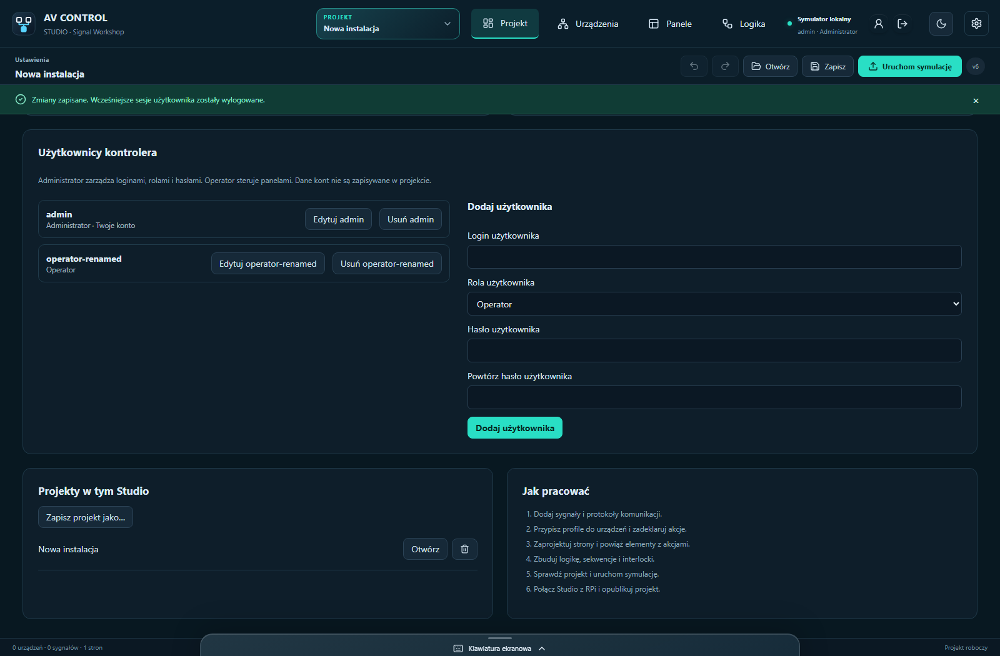
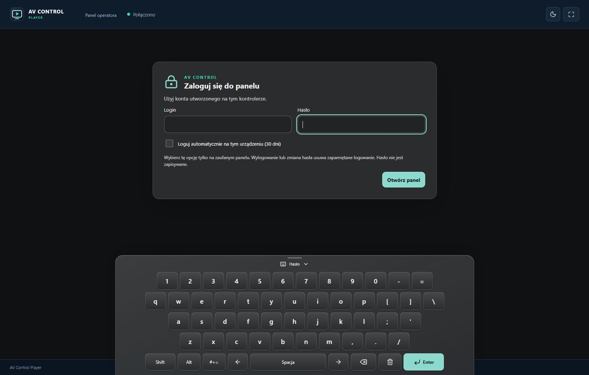

# Accounts, panel sign-in and onscreen keyboard — 1.5.5

Accounts belong to a controller or local simulator, not to the portable project. Raspberry Pi SSH/tty2 system accounts are separate from AV Control users.

Administrators manage users under **Settings → Controller users**. Create a unique username (up to 80 characters), choose administrator/operator and enter a matching password of at least 8 characters. **Edit** can rename the account, change its role or reset its password. Leave both password fields empty to retain the password. Saving an edit revokes the account's earlier sessions. Deletion requires confirmation; the last administrator cannot be deleted or demoted.

Player, browser and local HDMI panels show a themed sign-in screen before displaying controls. Use the account for that controller. Even an administrator signs into a Player/HDMI panel with operator-only permissions. Project editing, debugging and user administration are unavailable through that session.

The keyboard uses four QWERTY rows plus bottom controls. **Alt** switches letters to Polish programmer-layout accents (a→ą, c→ć, e→ę, l→ł, n→ń, o→ó, s→ś, x→ź, z→ż). **Shift** switches to uppercase and shifted punctuation (1→!, 2→@). **Alt+Shift** produces uppercase Polish letters. These are toggles: tap again to turn them off. Accents and punctuation replace the original key labels; there is no additional row. Cursor, backspace, clear, space and Enter controls are included. Physical keyboards work normally using their system layout.

Automatic sign-in is **off by default**. Select **Automatically sign in on this device (30 days)** explicitly to remember a revocable session. Manual sessions last 12 hours; remembered sessions last 30 days. Passwords are never saved for automatic sign-in. Windows protects stored sessions in the user's profile, Linux uses private files, browser sessions use a protected cookie, and HDMI remembers sessions privately on the controller.

Inside the panel, **My account** lets every user change their own password by entering the current password and the matching replacement. A successful change revokes all sessions of that account, including other panels and automatic sign-in. Administrators can reset other users through Settings. **Sign out of panel** revokes the current session and removes its remembered sign-in. Signing out of the HDMI kiosk does not open a desktop or system console.

The [detailed illustrated Polish guide](KONTA-I-LOGOWANIE-PL.md) includes a 60-minute training module covering roles, Alt/Shift input, password changes, remembered sessions, deletion and hardware acceptance. Screenshots are actual browser captures; the phone view is emulation. Physical HDMI, USB input and VT switching require separate hardware checks.

## Sliding keyboard

The shared keyboard slides up from the bottom when a text field is selected. Click the handle or drag it upward to reveal it, and click or drag downward to hide it. Escape hides the keyboard before closing an account dialog. Character keys have equal dimensions; the focused field stays above the dock. On narrow screens, **#+=** opens punctuation and **ABC** returns to letters. Alt/Shift keep Polish accents and shifted characters on their existing keys. Reduced-motion preferences disable the animation.
