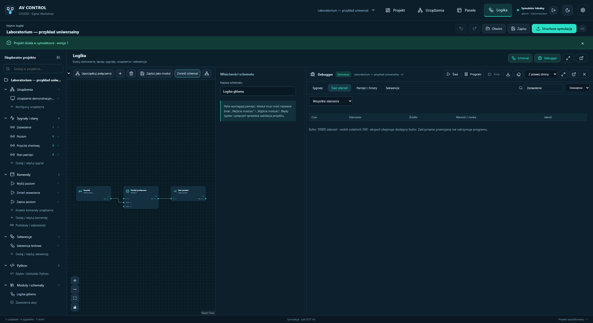
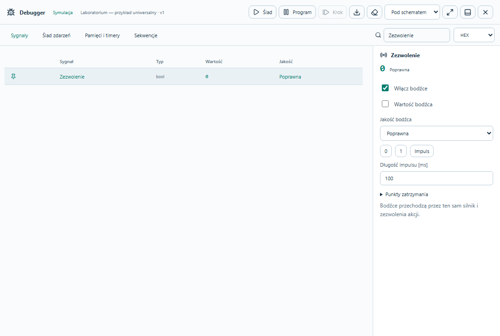
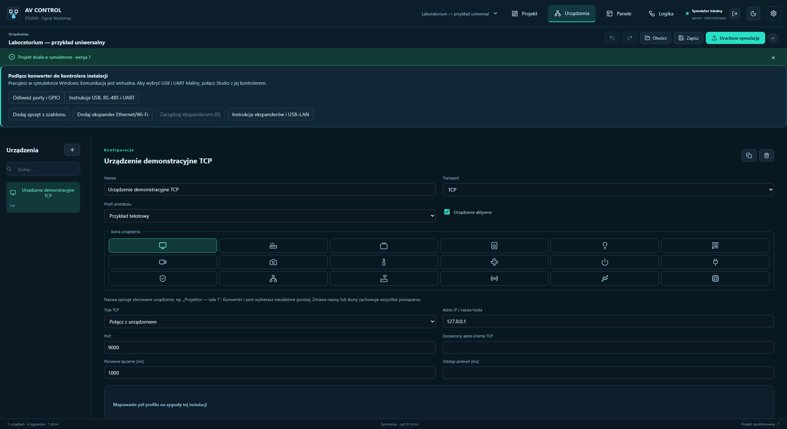

# Adjustable debugger layout and full-width configuration

[Polski](DEBUGGER-UKLAD-PL.md) | 10 October 2026

Open **Debugger** in Logic and select its placement above, below, left or right of the schematic. Drag the separator to adjust height or width. Double-click restores 50/50. The separator also supports Tab, arrow keys, Shift+arrow, Home, End and Enter. Placement and separate horizontal/vertical proportions persist locally.

The maximize button switches between the entire workspace and the split view. The external-window button opens an independent Windows or browser window for use on another monitor. Allow popups for Studio when using a browser. Moving the debugger preserves its tab, pinned signals, search and frozen trace. It remains live while the main Studio displays another tab, sharing the same controller and authenticated session.

Reattach or close the independent window to return to Logic. Logging out or closing Studio closes it. A connection error displays a warning and disables stimuli until communication recovers. Use the fit-schematic control if resizing moves symbols outside the viewport.

Device forms and Raspberry Pi configuration fill the available page width. The contextual configuration drawer in Logic also has an expand-to-workspace button.

Version 1.5.1 verification: [browser](evidence/debugger-layout-browser-1.5.1.json), [installed Windows Studio WebView2](evidence/debugger-layout-native-1.5.1.json). Tests use isolated simulators, covering resizing, saved preferences, popout/reattach, retained view state, interactive inputs after reattachment, cross-tab navigation, signal stimuli, themes, responsive layout, port geometry and logout. Blocked popups and connection recovery were additionally tested in the browser. No JavaScript errors occurred. Physical Raspberry Pi update evidence is reported separately.
