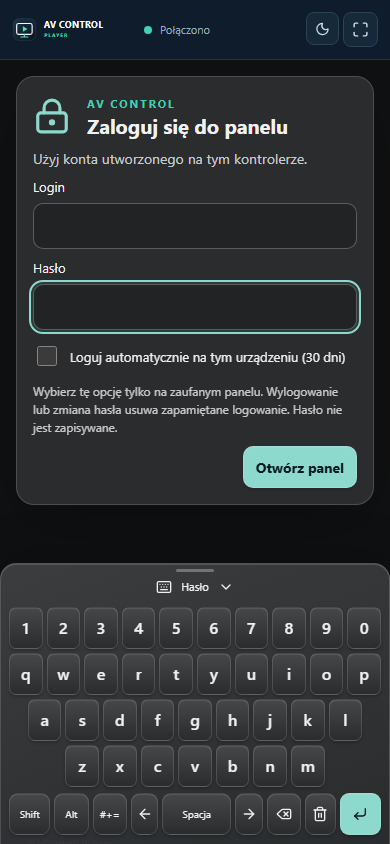

# Konta, logowanie do panelu i klawiatura ekranowa — 1.5.5

Ta instrukcja uzupełnia podręcznik Signal Workshop. Konta należą do konkretnego kontrolera lub lokalnego symulatora; plik projektu `.avctrl` nie zawiera haseł ani danych kont. Konto systemowe Raspberry Pi używane do SSH i tty2 jest oddzielne od konta AV Control.

## 1. Administrator i operator

Administrator zarządza projektem i kontami w Studio. Operator obsługuje opublikowane panele oraz zmienia własne hasło. Zalogowanie administratora w Playerze lub lokalnym panelu HDMI również otwiera sesję o uprawnieniach operatora: edycja projektu, zarządzanie kontami i debugger pozostają niedostępne z panelu.

Każdy kontroler przechowuje własną listę użytkowników. Najpierw połącz Studio z właściwą instalacją i sprawdź jej nazwę w prawym górnym rogu. Konta utworzone w symulatorze nie są automatycznie przenoszone na Raspberry Pi.

## 2. Dodawanie, edycja i usuwanie użytkowników

*Rzeczywisty zrzut interfejsu 1.5.5 z izolowanego symulatora. Nazwy użytkowników są demonstracyjne.*

1. Zaloguj się do Studio jako administrator i otwórz **Ustawienia**.
2. W sekcji **Użytkownicy kontrolera** wpisz login nowego użytkownika. Może mieć do 80 znaków; spacje na początku i końcu są usuwane. Każdy login musi być unikalny.
3. Wybierz **Operator** dla obsługi panelu lub **Administrator** dla edycji i konfiguracji.
4. Wpisz hasło i powtórz je. Hasło musi mieć co najmniej 8 znaków; wielkość liter oraz znaki specjalne mają znaczenie.
5. Kliknij **Dodaj użytkownika**. Sprawdź obecność konta na liście. Nie kopiuj hasła do projektu szkoleniowego ani zrzutów ekranu.
6. Aby zmienić istniejące konto, kliknij **Edytuj [login]**. Możesz zmienić login, rolę i hasło. Pozostaw oba pola nowego hasła puste, aby zachować obecne hasło.
7. Kliknij **Zapisz zmiany użytkownika**. Poprzednie sesje edytowanego konta zostają wylogowane, także sesje automatyczne. Użytkownik loguje się ponownie z aktualnymi danymi.
8. **Usuń [login]** otwiera potwierdzenie. Dopiero **Potwierdź usunięcie** kasuje konto i jego sesje. **Anuluj** pozostawia konto bez zmian.

Nie można usunąć ostatniego administratora ani zmienić jego roli na operatora. Jeśli chcesz zastąpić takie konto, najpierw utwórz drugiego administratora i sprawdź jego logowanie. Edycja własnego konta może wylogować także bieżące Studio; zaloguj się ponownie.

Administrator resetuje hasło innej osoby przez formularz edycji. Nie widzi obecnego hasła i nie musi go znać. Przekazanie nowego hasła użytkownikowi odbywa się poza aplikacją.

## 3. Pierwsze logowanie do panelu

1. Otwórz Player, panel przeglądarkowy lub podłącz ekran HDMI do kontrolera. Przed logowaniem nie można sterować opublikowanym projektem.
2. Kliknij lub dotknij pole **Login**. Wpisz nazwę konta utworzonego na tym kontrolerze.
3. Wybierz **Hasło** i wpisz hasło. Pole maskuje wpisane znaki.
4. Użyj klawiatury ekranowej lub fizycznej USB. Klawiatura płynnie wysuwa się od dolnej krawędzi po wybraniu pola. Możesz ją schować kliknięciem uchwytu, przeciągnięciem go w dół lub klawiszem Escape, a przywrócić dotknięciem innego pola lub pociągnięciem uchwytu w górę. Formularz pozostaje niezależny od klawiatury, a aktywne pole jest przewijane nad nią.
5. Opcja **Loguj automatycznie na tym urządzeniu (30 dni)** domyślnie pozostaje wyłączona. Zaznacz ją tylko wtedy, gdy chcesz zapamiętać dostęp na danym stanowisku.
6. Kliknij **Otwórz panel** lub ekranowy **Enter**. Błędne dane pozostawiają formularz logowania; sprawdź aktywne Alt i Shift oraz wielkość liter.

Ekran logowania i klawiatura korzystają z motywu strony panelu: kolorów, tła i materiału kontrolek. Motyw pochodzi z aktywnego, opublikowanego projektu. Samo zapisanie innego wyglądu w Studio nie zmieni jeszcze panelu kontrolera.

*Widok telefonu jest emulacją przeglądarkową. Nie stanowi potwierdzenia działania fizycznego telefonu ani ekranu dotykowego.*

## 4. Alt, Shift i edycja tekstu

Klawiatura ma cztery rzędy znaków QWERTY i dolny rząd przycisków sterujących. Wszystkie klawisze znaków mają jednakowe rozmiary. Na wąskim ekranie znaki interpunkcyjne znajdziesz przez **#+=**, a powrót do liter przez **ABC**. Alt i Shift nadal udostępniają polskie znaki i symbole bez dodatkowego rzędu. Polskie znaki i symbole zajmują miejsca zwykłych liter lub cyfr po włączeniu modyfikatora; nie tworzą dodatkowego rzędu.

| Włączenie | Efekt | Przykład |
|---|---|---|
| **Alt** | Polskie znaki w układzie programisty | a → ą, c → ć, e → ę, l → ł, n → ń, o → ó, s → ś, x → ź, z → ż |
| **Shift** | Wielkie litery i górne znaki klawiszy | a → A, 1 → !, 2 → @, 3 → #, 4 → $, 5 → %, 6 → ^, 7 → &, 8 → *, 9 → (, 0 → ), - → _, = → + |
| **Alt + Shift** | Wielkie polskie litery | a → Ą, x → Ź, z → Ż |
| **← / →** | Przesunięcie kursora w aktywnym polu | Poprawienie znaku w środku loginu |
| **⌫** | Usunięcie zaznaczenia lub znaku przed kursorem | Korekta pojedynczego znaku |
| **Wyczyść** | Usunięcie zawartości aktywnego pola | Ponowne wpisanie loginu |
| **Spacja** | Wstawienie spacji w miejscu kursora | Hasło zawierające spacje |
| **Enter** | Zatwierdzenie formularza | Logowanie lub zmiana hasła |

Alt i Shift działają jako przełączniki. Dotknij raz, aby włączyć; aktywny przycisk jest wyróżniony. Dotknij ponownie, aby wyłączyć. Nie trzeba przytrzymywać klawisza palcem. Widoczne etykiety liter i symboli pokazują aktualne znaki przed wpisaniem.

Ćwiczenie: wyczyść login, włącz Alt i dotknij **ą**, włącz Shift i dotknij **Ą**, wyłącz Alt i dotknij **!**. Pole powinno zawierać `ąĄ!`. Następnie wyłącz Shift, wyczyść pole i wpisz rzeczywisty login.

Klawiatura fizyczna działa zgodnie z układem ustawionym w systemie stanowiska. Ekranowe przełączniki nie zmieniają systemowego układu USB; możesz zwyczajnie wpisać login i hasło fizyczną klawiaturą.

## 5. Zmiana własnego hasła, wylogowanie i pamiętanie sesji

W zalogowanym panelu otwórz **Moje konto**. Wpisz **Dotychczasowe hasło**, **Nowe hasło** i **Powtórz nowe hasło**, następnie wybierz **Zmień hasło**. Klawiatura wysuwa się po wybraniu każdego pola także w tym formularzu. Pierwszy Escape chowa klawiaturę, drugi zamyka okno konta. Każdy użytkownik może zmienić swoje hasło; operator nie może zmieniać hasła innych osób.

Po udanej zmianie wszystkie sesje tego konta tracą ważność. Panel wraca do logowania i wymaga nowego hasła. Dotyczy to również innych przeglądarek oraz Playerów, które zapamiętały konto. Bez zmiany hasła bieżące logowanie ręczne wygasa po 12 godzinach; logowanie automatyczne po 30 dniach. Po wygaśnięciu trzeba zalogować się ponownie.

Przycisk **Wyloguj z panelu** pozostaje dostępny wewnątrz panelu, również na HDMI. Wylogowuje daną sesję i usuwa jej zapamiętanie. Sam restart widoku nie jest wylogowaniem: gdy wybrano logowanie automatyczne, aktualna sesja może zostać przywrócona. Po wylogowaniu restart nie przywróci panelu bez ponownego podania danych.

Hasło nie jest zapisywane do logowania automatycznego. Zapamiętywana jest odwoływalna sesja: w przeglądarce jako chroniony cookie, w Windows w chronionym magazynie profilu użytkownika, w Linux w prywatnym pliku użytkownika, a dla HDMI na kontrolerze. Plik projektu i jego biblioteki nie zawierają tych danych. Usunięcie konta, reset hasła i edycja konta unieważniają jego sesje.

W zwykłym Playerze przełączanie połączeń wymaga kont na odpowiednich kontrolerach. Lokalny ekran HDMI jest na stałe przypisany do własnego Raspberry Pi. Wylogowanie z AV Control nie otwiera pulpitu ani konsoli systemowej; wejście do tty2 klawiaturą nadal jest odrębną funkcją serwisową.

## 6. Moduł szkolenia: konta i stanowisko dotykowe (60 minut)

Pracuj w izolowanym symulatorze i neutralnym projekcie. Nie resetuj produkcyjnych kont ani nie włączaj fizycznych urządzeń podczas ćwiczenia.

1. **10 min — role.** Utwórz konto operatora i drugiego administratora. Sprawdź, na którym kontrolerze zapisujesz konta. Uzasadnij różnicę między kontem AV Control a SSH.
2. **10 min — wpisywanie.** Otwórz panel wylogowany. Wykonaj ćwiczenie `ąĄ!`, a następnie wpisz login i hasło. Wysuń i schowaj klawiaturę uchwytem; sprawdź, że pole hasła pozostaje widoczne. Przetestuj kursor, usuwanie oraz fizyczną klawiaturę. Sprawdź wyróżnienie Alt i Shift.
3. **10 min — sesje.** Zaloguj się bez pamiętania, wyloguj i odśwież. Następnie zaznacz pamiętanie, zaloguj i ponownie otwórz widok; panel powinien wrócić. Wyloguj i sprawdź, że zapamiętanie usunięto.
4. **10 min — własne hasło.** Zmień hasło operatora w **Moje konto**. Sprawdź wylogowanie drugiego otwartego panelu. Stare hasło ma zostać odrzucone; nowe przyjęte.
5. **10 min — administracja.** Zmień login i zresetuj hasło operatora. Sprawdź ponowne logowanie. Usuń konto testowe i sprawdź odmowę logowania. Spróbuj usunąć ostatniego administratora na osobnym symulatorze: aplikacja musi odmówić.
6. **10 min — wygląd i odbiór.** Porównaj ekran logowania w ciemnym, jasnym i szklanym motywie. Na rzeczywistym stanowisku HDMI sprawdź dotyk, USB, wylogowanie i brak opuszczenia kiosku myszą. Zapisz oddzielnie wyniki emulacji i fizycznego sprzętu.

**Zaliczenie:** brak dostępu przed logowaniem; poprawne Alt/Shift bez dodatkowego rzędu; operator zmienia tylko własne hasło; administrator zarządza kontami; ostatni administrator pozostaje chroniony; automatyczne logowanie wymaga zaznaczenia; wylogowanie i reset hasła kończą właściwe sesje. Przy braku monitora lub dotyku oznacz próbę sprzętową jako NIEWERYFIKOWANĄ.
