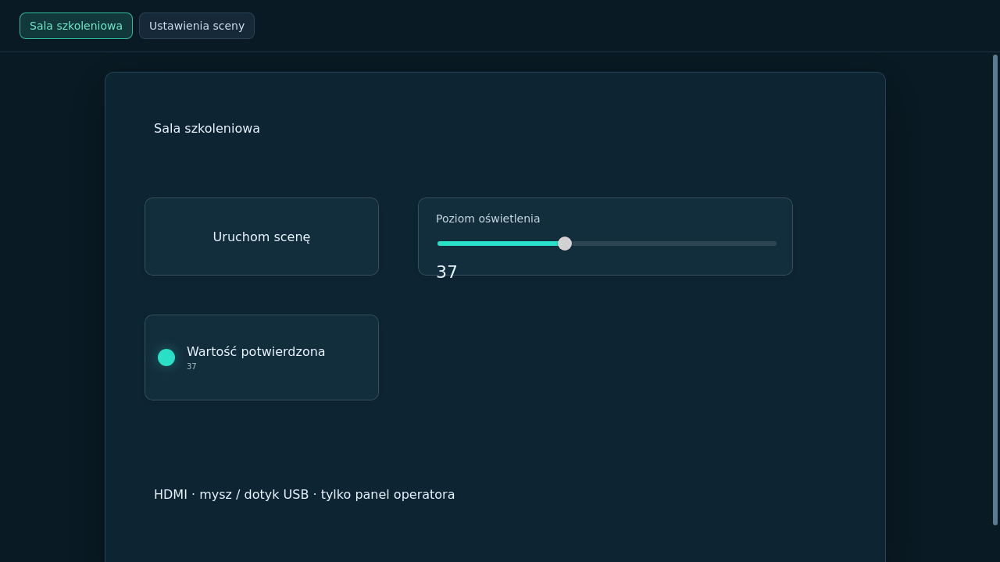

# Panel lokalny HDMI — Raspberry Pi

Od wersji **1.5.4** kontroler może być jednocześnie odtwarzaczem panelu. Funkcja jest włączona domyślnie w nowym obrazie dla RPi 3B, 4B i 5. Aktualizacja istniejącego kontrolera instaluje ten sam mechanizm i wszystkie wymagane pakiety, bez ponownego zapisywania karty SD.

## 1. Przygotowanie instalacji

1. W AV Control Studio utwórz stronę panelu i dodaj elementy sterujące.
2. Powiąż przyciski i regulatory z akcjami lub sygnałami. Skonfiguruj zezwolenia tak samo jak dla paneli obsługiwanych przez sieć.
3. Opublikuj projekt na Raspberry Pi. Lokalny ekran pokazuje **aktywny, opublikowany projekt**, a nie niezapisane zmiany w Studio.
4. Podłącz monitor HDMI. W RPi 3B użyj pełnowymiarowego HDMI; w RPi 4B i 5 — micro HDMI. Zasil monitor zgodnie z jego instrukcją.
5. Podłącz mysz, touchpad lub ekran dotykowy USB. Ekran z dotykiem zwykle potrzebuje dwóch połączeń: HDMI przesyła obraz, USB przekazuje dotyk. Sam przewód HDMI nie przekazuje dotyku.
6. Poczekaj na automatyczne wyświetlenie panelu. Po wykryciu monitora usługa uruchamia grafikę; bez monitora nie uruchamia środowiska graficznego ani widoku WWW.

Od **1.5.5** przed panelem pojawia się logowanie kontem AV Control z tego kontrolera. Dostępna jest klawiatura ekranowa z Alt/Shift i opcja zapamiętania sesji na 30 dni, domyślnie wyłączona. Sesja HDMI ma tylko uprawnienia operatora. Zobacz [konta, hasła i klawiaturę — instrukcja oraz moduł szkolenia](KONTA-I-LOGOWANIE-PL.md).

## 2. Obsługa



*Screenshot pochodzi z działającego GTK/WebKit w sesji Cage Wayland z wirtualnym ekranem. Nie jest zdjęciem monitora podłączonego do Raspberry Pi.*

Mysz: klikaj przyciski i przeciągaj regulatory. Touchpad: używaj wskaźnika i kliknięć. Dotyk: dotykaj elementów i przesuwaj regulatory palcem. Zakładki stron i przyciski nawigacji pozostają częścią panelu.

Na ekranie nie ma Studio, paska adresu, pulpitu, menedżera plików ani konfiguracji połączenia. Dostępne są **Moje konto** do zmiany własnego hasła i **Wyloguj z panelu**, które wraca do ekranu logowania. Menu prawego przycisku, otwieranie nowych okien, wybór plików, pobieranie plików i gesty historii przeglądarki są zablokowane. Przewijanie treści panelu pozostaje dostępne, gdy strona nie mieści się na ekranie.

Obsługiwane są urządzenia wejściowe rozpoznawane przez Linux/libinput, w szczególności standardowe USB HID. Specjalistyczne ekrany wymagające sterownika producenta lub kalibracji należy sprawdzić osobno. Podłączenie kilku ekranów nie tworzy niezależnych paneli: kiosk pokazuje panel na ostatnim wykrytym monitorze.

## 3. Konsola serwisowa z klawiatury

| Skrót | Działanie |
|---|---|
| **Ctrl+Alt+F2** | Przejście do tty2 — ekran logowania systemowego |
| **Ctrl+Alt+F1** | Powrót do lokalnego panelu |

Na klawiaturze multimedialnej może być potrzebny dodatkowy klawisz **Fn**. Zaloguj się własnym kontem systemowym, np. utworzonym podczas przygotowania karty w Imagerze. Kiosk nie otwiera konsoli automatycznie zalogowanej i nie nadaje operatorowi uprawnień administratora. Po pracy wykonaj `exit`, następnie wróć do panelu. Dostęp przez SSH nadal działa.

## 4. Ustawienia w interfejsie WWW

Zaloguj się w Studio lub interfejsie WWW jako administrator. Otwórz **Ustawienia → Konfiguracja Raspberry Pi → Panel lokalny HDMI**.

- **Automatycznie wyświetlaj panel po podłączeniu monitora** — wyłączenie zamyka sesję graficzną; silnik i zdalne panele nadal działają.
- **Strona początkowa** — wybierz pierwszą stronę projektu lub konkretną stronę aktywnego projektu.
- **Zapisz ustawienia panelu** — zapisuje ustawienia na kontrolerze, zachowując je po restarcie i aktualizacji.
- W tej sekcji widoczny jest stan wykrywania HDMI i uruchomienia panelu.

Po aktywacji innego projektu nieistniejąca już strona początkowa zastępowana jest pierwszą stroną nowego projektu. Nowa konfiguracja strony nie zmienia samodzielnie sygnałów ani nie wysyła komend.

## 5. Odłączenie, restart i brak projektu

Odłączenie wszystkich monitorów zatrzymuje sesję graficzną. Ponowne podłączenie odtwarza aktualny panel. Restart widoku, monitora lub kontrolera **nie powtarza wcześniejszych kliknięć i wartości regulatorów**. Akcje startowe skonfigurowane w samym projekcie pozostają odrębnym mechanizmem silnika.

Przerwane przytrzymanie przycisku wygasa zgodnie z mechanizmem dzierżawy wejścia. Podczas utraty połączenia widok wyświetla informację o ponownym łączeniu i nie przyjmuje nowych żądań. Brak opublikowanego projektu wyświetla informację o oczekiwaniu na panel.

## 6. Diagnostyka administratora

```sh
systemctl status avcontrol-kiosk.service seatd.service getty@tty2.service
journalctl -u avcontrol-kiosk.service -b --no-pager
cat /sys/class/drm/card*-HDMI-A-*/status
sudo libinput list-devices
```

Oczekiwane stany: `waiting-hdmi` bez monitora, `running` podczas wyświetlania panelu, `disabled` po wyłączeniu funkcji. Nie wklejaj zawartości pliku lokalnej sesji do zgłoszeń diagnostycznych — zawiera krótkotrwały klucz operatora. Karta powinna mieć wolne miejsce na pakiety graficzne; aktualizator dołącza je do zweryfikowanego pakietu i instaluje również bez dostępu do internetu.

## 7. Moduł szkolenia: lokalne stanowisko operatorskie (60 minut)

**Cel:** samodzielne uruchomienie panelu na HDMI, sprawdzenie nawigacji i wejść USB oraz bezpieczne użycie konsoli.

1. **10 min — projekt.** Otwórz neutralny projekt szkoleniowy, utwórz dwie strony i przycisk nawigacji. W symulatorze powiąż przycisk ze zmianą sygnału, a suwak ze zmienną liczbową.
2. **10 min — publikacja.** Wybierz kontroler, opublikuj i porównaj jego numer rewizji ze Studio. Używaj urządzeń wirtualnych lub wyłączonych.
3. **15 min — HDMI i USB.** Podłącz monitor, mysz i dotyk. Sprawdź obie strony, przyciski i końcową wartość suwaka. Spróbuj prawego kliknięcia, gestu cofania i przeciągnięcia pliku — panel nie powinien otworzyć innej aplikacji.
4. **10 min — ustawienia.** Wybierz drugą stronę jako początkową. Wyłącz i ponownie włącz panel zdalnie. Zwróć uwagę, że silnik wciąż działa.
5. **10 min — odporność.** Odłącz i podłącz monitor. Sprawdź brak powtórzenia poprzedniej akcji. Przytrzymaj chwilowy przycisk i odłącz wejście; sprawdź wygaśnięcie przytrzymania w debuggerze.
6. **5 min — serwis.** Ctrl+Alt+F2, własne logowanie, odczyt stanu usługi, `exit`, Ctrl+Alt+F1.

**Odbiór na fizycznym sprzęcie:** poprawny obraz i dotyk, automatyczne wykrywanie HDMI, działające przejście do tty2, brak wyjścia poza panel gestami i myszą, brak powtórzenia akcji po ponownym uruchomieniu. Wyniki programowych testów kiosku nie zastępują tego odbioru.

Podstawa techniczna: [Cage — tryb kiosku i przełączanie VT](https://github.com/cage-kiosk/cage/blob/master/cage.1.scd), [Raspberry Pi — konfiguracja wyświetlaczy](https://www.raspberrypi.com/documentation/computers/configuration.html), [libinput — urządzenia wejściowe](https://wayland.freedesktop.org/libinput/doc/latest/).
