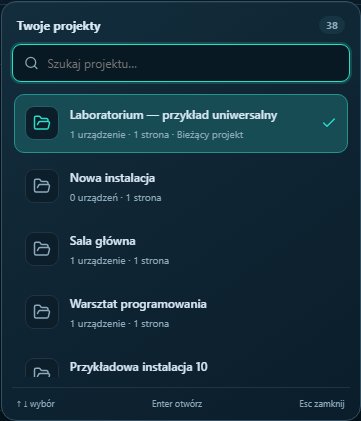
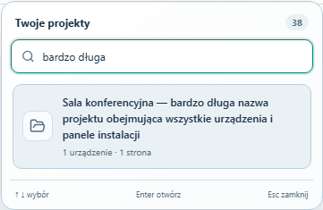

# Project picker

[Polski](WYBOR-PROJEKTU-PL.md) | AV Control 1.5.3

Click the highlighted **PROJEKT** selector in the header. The application renders its own menu with themed gradients, rounded corners, a translucent background and matching scrollbar. Navigation and account, appearance and settings controls keep their positions on the right.

The current project appears first with a check mark. Each row includes device and page counts. Long names wrap and larger libraries scroll inside the menu. Type in **Szukaj projektu** to filter. Search ignores case and Polish accents, including `ł`: `sala glowna` finds **Sala główna**.

Use Enter/Space to open the selector, arrow keys to navigate, Enter to choose and Escape to close. Tab closes the menu and moves to the next navigation button. Clicking outside also closes it. Choosing the current project preserves undo/redo history. Selecting a document does not deploy it; controller activation still uses the publishing workflow.

Browser and installed Studio receipts: [1.5.3 documentation](https://github.com/Gartom91/av-control-studio/releases/download/v1.5.3/AV-Control-Studio-1.5.3-Dokumentacja.zip).
